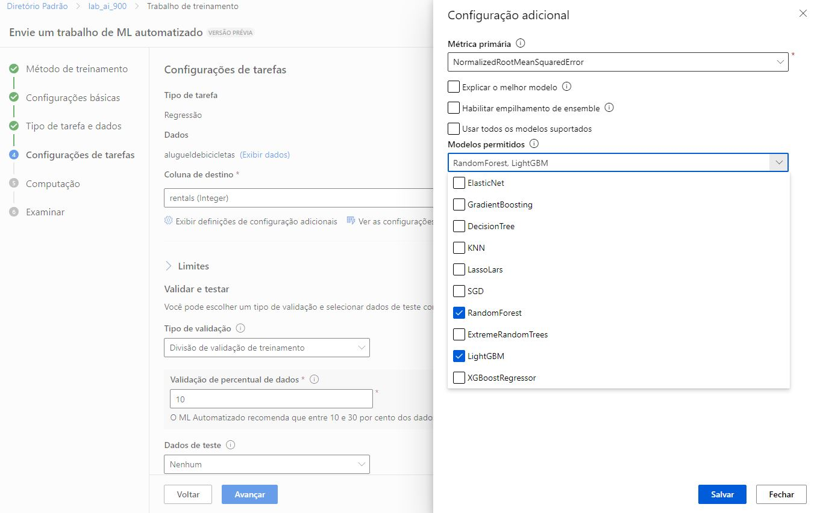

# Trabalhando com Machine Learning


## Passo 1

- Criar uma conta no [https://azure.microsoft.com/pt-br/free].
- O cadastro é criado quando clicar nesse botão "Experimentar gratuitamente".


<br>

## Passo 2

- Entrar na plataforma do [Portal Azure](https://portal.azure.com).
- Pesquisar por "Azure Machine Learning" nesse campo de pesquisa selecionar Azure Machine Learning.


<br>

## Passo 3
- Apertar em "Criar", para criar um Novo workspace.


<br>

## Passo 4

- Criar um novo "resource group", criar um "nome", a "região", e Apertar em "Examinar + criar".


<br>

- Esperar até que a validação ser aprovada, e então Apertar em "criar".


<br>

## Passo 5

- A implantação está em andamento e pode ser acompanhada na tela que será aberta automaticamente.


<br>

- Esta é a tela de finalização do deploy. Agora podemos Apertar em "ir para o recurso".


<br>

- Na tela do recurso, apertar em "Iniciar estúdio".


<br>

## Passo 6

- O diretório do workspace é então aberto.
- Posso visualizar todos os workspaces existentes, Apertando em "Todos os Espaços de Trabalho".


<br>

-  Aperte No workspace que você criou.


<br>

## Passo 7

- O workspace escolhido é aberto. 

<br>

- Selecione no ambiente ML automatizado e depois em criar um Novo trabalho de ML automatizado.


<br>

## Passo 8

- Preencher os dados do job com as informações (fornecidas pela documentação da Microsoft).

- 8.1 -> Preenchimento das informações básicas. Quando Terminar de Preencher Aperte em Avançar.


<br>

- 8.2 -> Escolha do tipo de tarefa (Regressão) e Aperte em criar.


<br>

- 8.3 -> Preencha as informações e Aperte em Avançar.
  

<br>

- 8.4 -> Escolha a fonte dos dados e Aperte em Avançar.


<br>

- 8.5 -> Escreva a url e Aperte em Avançar. A url passa por uma verificação e validação.


<br>

- 8.6 -> Os dados devem estar com as seguintes configurações e quando terminar de preencher apertar em Avançar.


<br>

- 8.7 -> Ele traz uma visualização do Esquema. Não é necessário alterar nenhuma informação e Aperte em Avançar.


<br>

- 8.8 -> Por fim, ele traz todas informações para Examinar, e Aperte em "criar", para criar o Base de Dados.


<br>

- 8.9 -> Para avançar, selecione a Base de Dados, e Aperte em "Avançar".


<br>

- 8.10 -> Configurações da tarefa.

- Tipo de tarefa: Regressão, Conjunto de dados: aluguel de bicicletas, Coluna de destino: Aluguéis (inteiro)


<br>

- Configurações adicionais: Métrica primária: raiz do erro quadrático médio normalizado, Explique o melhor modelo: Não selecionado, Usar todos os modelos suportados: Desmarcado, Modelos permitidos: Selecione apenas RandomForest e LightGBM


<br>

- Limites: Expanda esta seção, Máximo de testes: 3, Máximo de testes simultâneos: 3, Máximo de nós: 3, Limite de pontuação da métrica: 0.085, Tempo limite: 15, Tempo limite de iteração: 15, Habilitar rescisão antecipada: selecionado
- Validação e teste: Tipo de validação: divisão de validação de treinamento, Porcentagem de dados de validação: 10, Conjunto de dados de teste: Nenhum


<br>


- 8.11 -> Não é preciso escrever nenhuma informação diferente na tela Computação.


<br>

- 8.12 -> As informações são trazidas e pode enviar o trabalho de treinamento.


<br>

## Passo 9
- O modelo inicia o treinamento até a finalização.


<br>

## Passo 10
- Validar métricas.
- 10.1 -> Acessar as informações do modelo conforme imagem abaixo.


<br>

- 10.2 -> Acessar o trabalho.


<br>

## Passo 11

- Avaliar o melhor modelo: Quando o trabalho automatizado de aprendizado de máquina for concluído, você poderá revisar o melhor modelo treinado.
- Selecione o texto em Nome do algoritmo do melhor modelo para visualizar seus detalhes


<br>

- Selecione a guia Métricas e selecione os gráficos
residuais e predito_true se eles ainda não estiveremselecionados.


<br>

- Revise os gráficos que mostram o desempenho do modelo. O gráfico de resíduos mostra os resíduos
como um histograma. O gráfico predito_true compara os valores previstos com os valores verdadeiros.


<br>

## Passo 12
- Implantar e Testar do Modelo.
- 12.1 -> De volta à página do modelo, escolhemos a opção de Implantar Serviço Web.


<br>

- 12.2 -> Preencher com as informações fornecidas na documentação e Apertar em "Implantar".


<br>

- 12.3 -> Após receber a notificação de que a Implantação foi concluída, no menu esquerdo, vamos Apertar na aba Pontos de extremidade e depois no ponto recém criado.


<br>

- 12.4 -> Na tela de Pontos de extremidade, confirma o status "Succeeded" do Implantar, e Apertamos na aba "Testar"


<br>

- 12.5 -> Para o teste, utilizei o json abaixo:

  
 ```
 {
   "Inputs": { 
     "data": [
       {
         "day": 1,
         "mnth": 1,   
         "year": 2022,
         "season": 2,
         "holiday": 0,
         "weekday": 1,
         "workingday": 1,
         "weathersit": 2, 
         "temp": 0.3, 
         "atemp": 0.3,
         "hum": 0.3,
         "windspeed": 0.3 
       }
     ]    
   },   
   "GlobalParameters": 1.0
 }

```


<br>

- 12.6 -> Resultado do Teste.

 ```
{
  "Results": [
    350.6746367646949
  ]
}

```


<br>