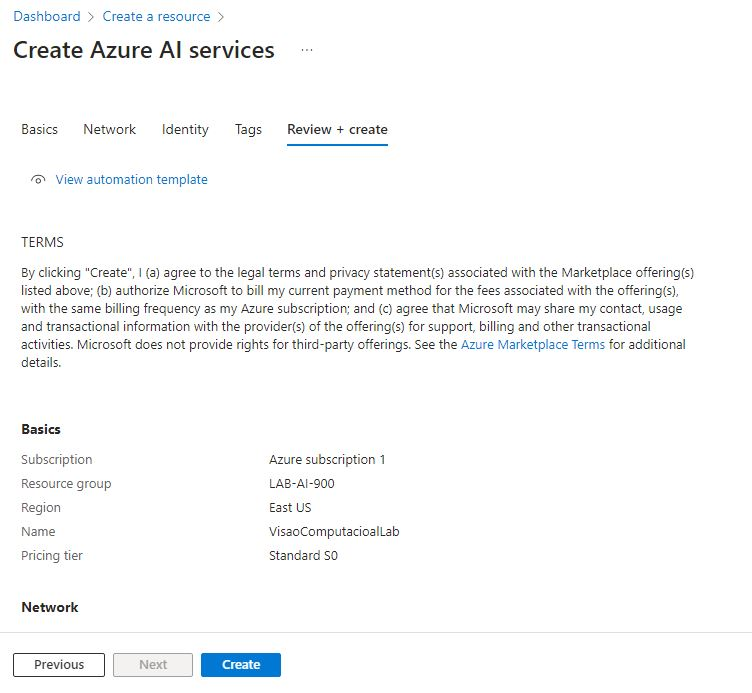

# Trabalhando com Visão Computacional

## Passo 1

- Entrar na plataforma do [Portal Azure](https://portal.azure.com).
- Clicar em Create a resource, nas categorias selecionar AI + Machine Learning e clicar em Create em "Azure AI Services".

## Passo 2

### Na página que se abrir preencha os campos conforme abaixo: 

- Assinatura: sua assinatura do Azure .
- Grupo de recursos: selecione ou crie um grupo de recursos com um nome exclusivo .
- Região: Leste dos EUA.
- Nome: Insira um nome exclusivo .
- Nível de preços: Standard S0.
- Ao marcar esta caixa, confirmo que li e compreendi todos os termos abaixo : Selecionado .

- Clicar em Review + create e depois em Create

## Passo 3

### Conectar o recurso recém-criado ao Vision Studio: 

- Em outra guia do navegador, abra o portal do [Vision Studio](https://portal.vision.cognitive.azure.com)
- Na página que abrir clicar em View all resources

- Selecionar o recurso recém-criado e clicar em Select as default resource

- Não é aberto nenhuma mensagem, o recurso fica marcado apenas como default.
- Depois é clicar em fechar e retornar a página anterior.

## Passo 4

### Detecção de Face no Vision Studio: 

- Na página inicial do Portal Vision selecione a guia Face e depois clique em Detect faces in an image

- Na página que abrir devemos reconhecer a política de usos, marcando a caixa de seleção.
- No caso vamos trabalhar com a mossa primeira imagem de input.

## Passo 5

### Analise de Documentos no Vision Studio: 

- Na página inicial do Portal Vision selecione a guia Optical character recognition e depois clique em Extract text from images.

- Na página que abrir devemos reconhecer a política de usos, marcando a caixa de seleção.
- No caso vamos trabalhar com a mossa segunda imagem de input.

## Passo 6

### Analise de Imagens no Vision Studio: 

- Na página inicial do Portal Vision selecione a guia Image analysis e depois clique em Add captions to images.

- Na página que abrir devemos reconhecer a política de usos, marcando a caixa de seleção.
- No caso vamos trabalhar com a mossa terceira imagem de input.

## Considerações Finais

 Tais recursos trazem inúmeras soluções para o dia a dia, o recurso de detecção e descrição da imagem enriquece ainda mais sistemas de segurança, os quais identificarão as faças de quem passar a frente das câmeras, assim como reconhecer rostos ja conhecidos.O recurso de estração de texto ajudará inumeras empresas a gerenciar seus arquivos antigos, assim como escanear e guardar dados de notas, facilitando assim a manutenção dos arquivos e o tempo para ter aesso aos mesmos.