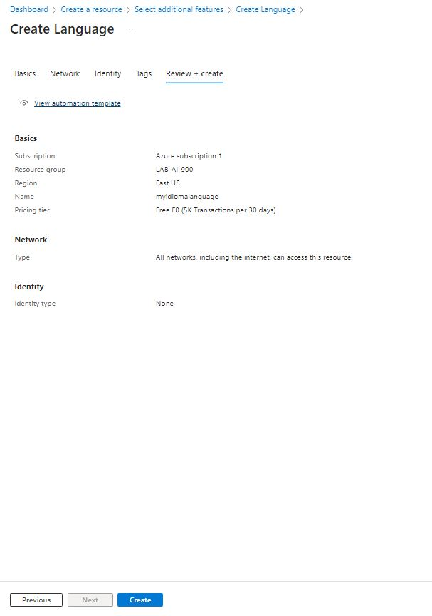

# Trabalhando com Análise de Sentimentos com Language Studio

## Passo 1

- Entrar na plataforma do [Portal Azure](https://portal.azure.com).
- Clicar em Create a resource, nas categorias selecionar AI + Machine Learning e clicar em Create em "Language service".

- Clicar em Continuar para criar seu recurso

## Passo 2
### Na página que se abrir preencha os campos conforme abaixo: 

- Assinatura: sua assinatura do Azure.
- Grupo de recursos: selecione ou crie um grupo de recursos com um nome exclusivo.
- Região: Leste dos EUA.
- Nome: Insira um nome exclusivo.
- Nível de preços : Free F0.
- Confirmo que li e compreendi todos os termos abaixo: Selecionado

### Selecione Review + create e depois Create e aguarde a conclusão da implantação

- Após aguardar alguns segundos o recurso é criado:

- Clique em Go to resource group.
- Verificar se o mesmo já com o estado de ativo para poder prosseguir, as vezes pode demorar um pouco.

## Passo 3
### Configurar o seu recurso no Azure AI Language Studio

- Em outra guia do navegador abra o portal do [Language
Studio](https://language.cognitive.azure.com)
- Após fazer login com a mesma senha do Portal Azure Na primeira página quando solicitado, preencher com o seguinte:

- Diretório do Azure: diretório padrão, o diretório que você está usando.
- Assinatura do Azure: selecione a assinatura que você está usando
- Tipo de recurso: Language
Nome do recurso : selecione o recurso de serviço de idioma que você acabou de criar.

- Em seguida, selecione Done.

## Passo 4
### Analise de avaliações no Language Studio.

- Na página inicial do portal do Language Studio selecionar Create new, e depois em Classify Text por fim Analyze sentiment an mine opinions.

- Após isso realizar as configurações conforme o texto que vai ser analisado.

- Resultados obtidos:

## Considerações Finais  

 Tal recurso facilita bastante o dia a dia, uma vez que possibilita saber de forma ágil e simples o sentimento dos clientes no que diz respeito aos seus produtos, o que eles mais gostaram, menos gostaram e a possibilidade de voltarem a consumir o produto ou serviço, possibilitando assim a reação rápida por parte da empresa.