# Trabalhando com o serviço de índice de Pesquisa do Azure Cognitive Search

## Passo 1
### Aprovisionando os recursos necessários do Azure

Para realizar este laboratório, foi necessário aprovisionar, no [Portal do Azure](https://portal.azure.com/), os 3 serviços abaixo:

- ***Azure AI Search***: para gerenciará a indexação e a consulta;
- ***Azure AI Services***: para enriquecer os dados na fonte de dados com *insights* gerados por IA;
- ***Storage Account***: para armazenar os documentos brutos

> [!NOTE]
> Os 3 serviços precisaram ser aprovisionados no mesmo local (região), para permitir a integração entre eles

### 1.1 Aprovisionar o ***Azure AI Search***, na região ***East US***:

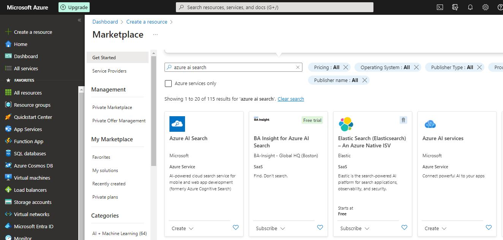

- Escolher **Create**;

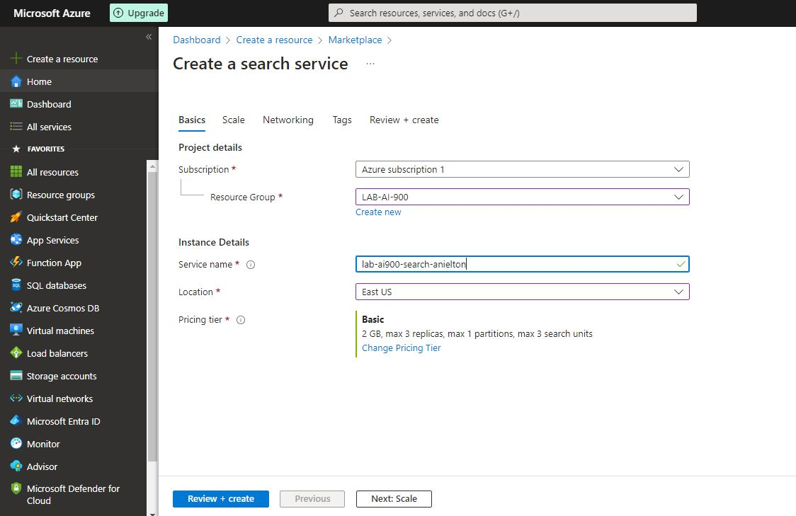

- Clicar em **Review + create**;

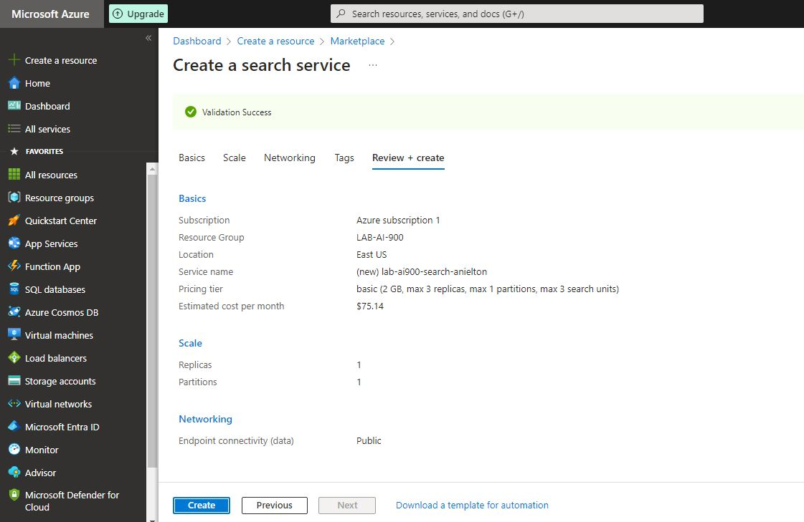

- Clicar em **Create**;

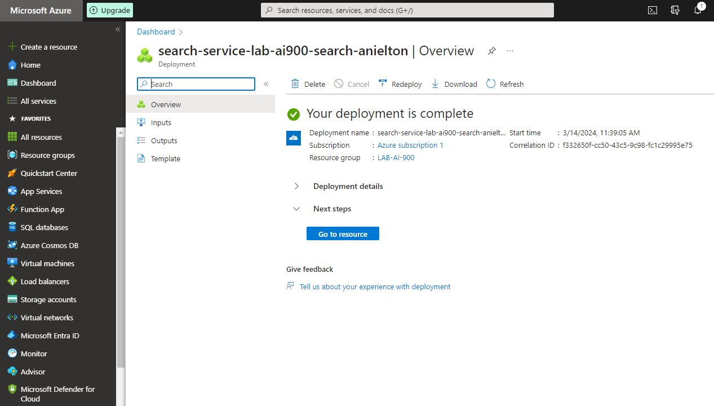

- Aguardar até que o deploy esteja completo.

### 1.2 Aprovisionar o ***Azure AI Services***, na região ***East US***:

- Escolher **Create**;

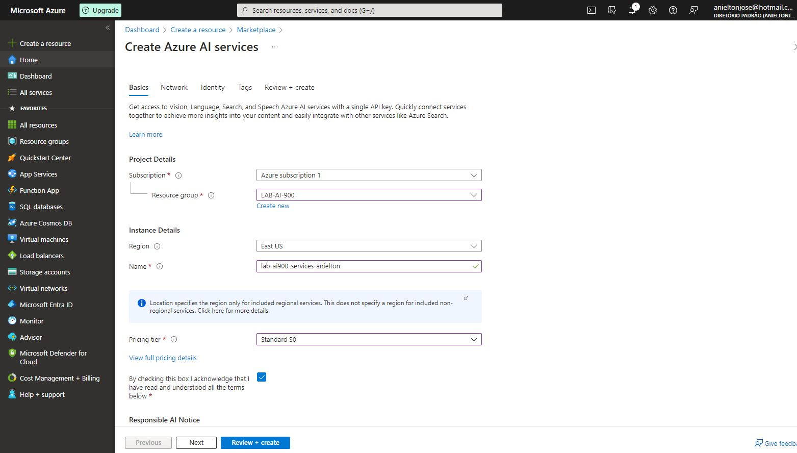

- Clicar em **Review + create**;

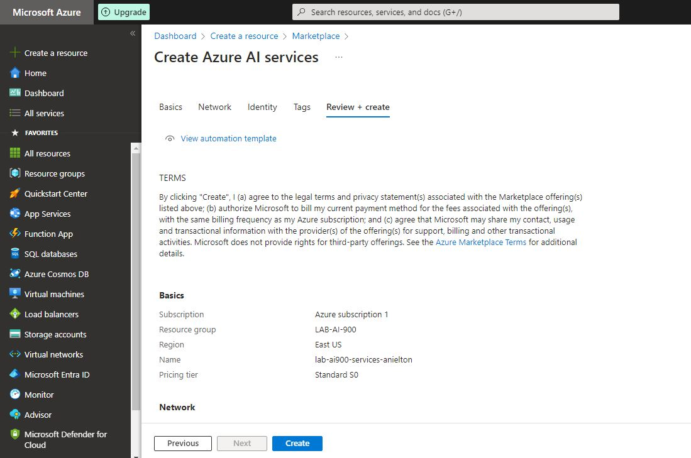

- Clicar em **Create**;

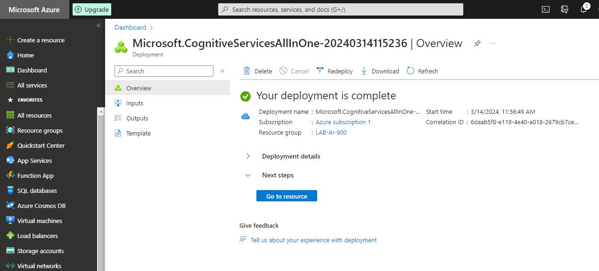

- Aguardar até que o deploy esteja completo.

### 1.3 Aprovisionar o ***Storage Account***, na região ***East US***:

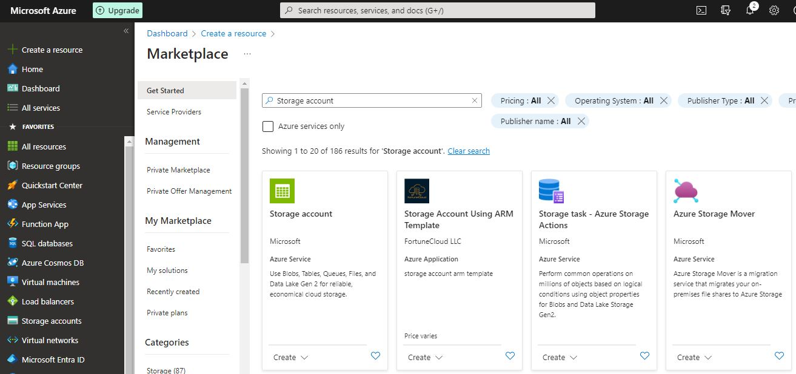

- Escolher **Create**;

- Clicar em **Review + create**;

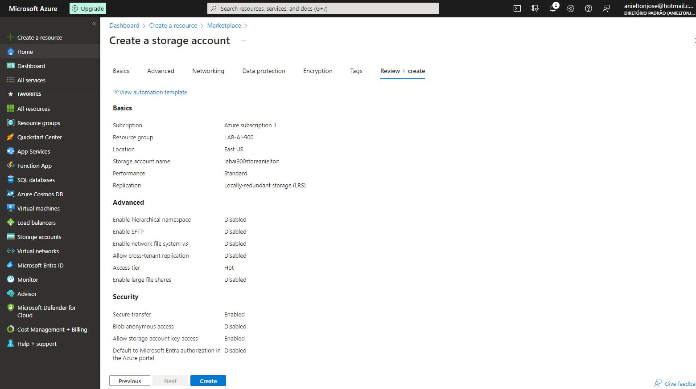

- Clicar em **Create**;

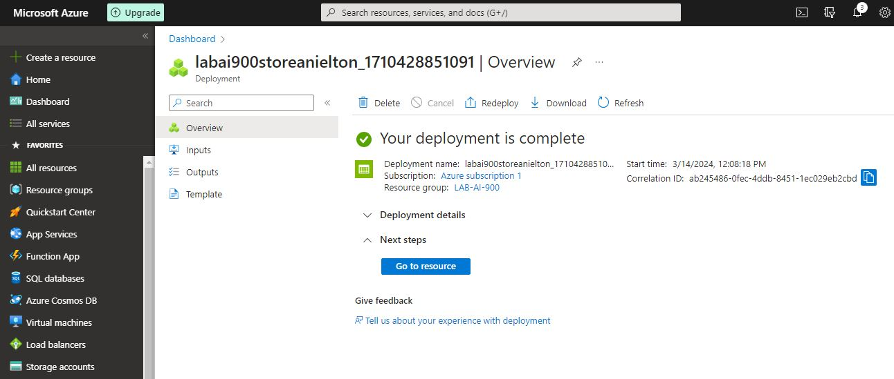

- Aguardar até que o deploy esteja completo.

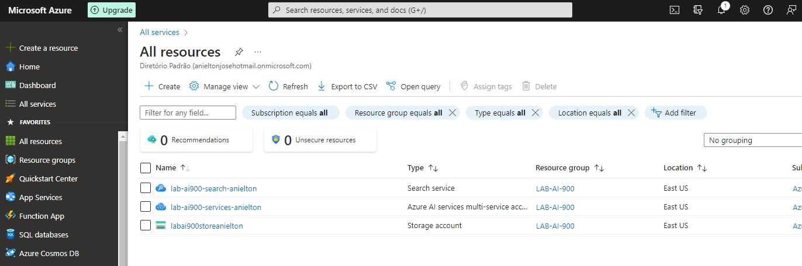

- Ao final teremos uma tela como esta mostrando os serviços necessários.