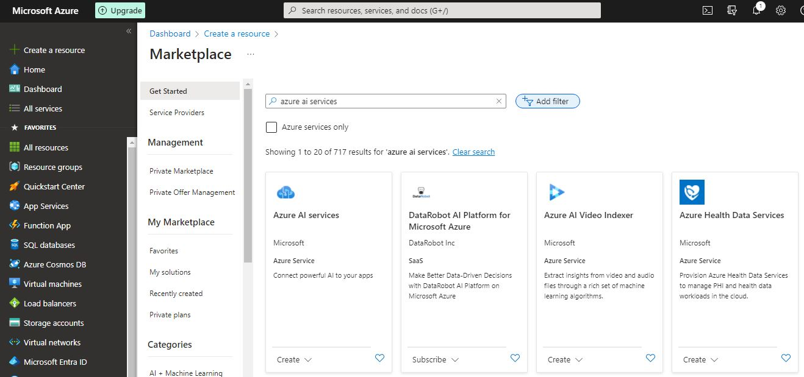
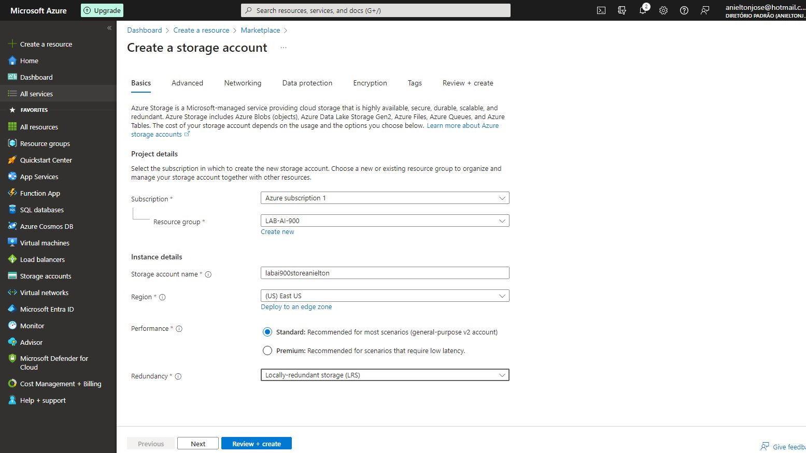
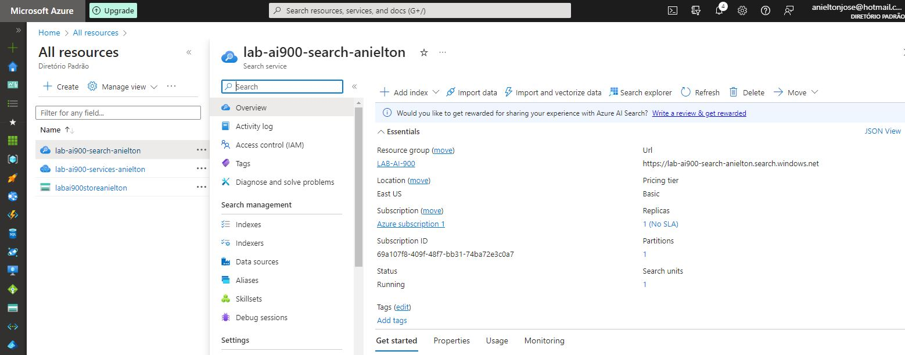

# Trabalhando com o serviço de índice de Pesquisa do Azure Cognitive Search

## Passo 1
### Aprovisionando os recursos necessários do Azure

Para realizar este laboratório, foi necessário aprovisionar, no [Portal do Azure](https://portal.azure.com/), os 3 serviços abaixo:

- ***Azure AI Search***: para gerenciará a indexação e a consulta;
- ***Azure AI Services***: para enriquecer os dados na fonte de dados com *insights* gerados por IA;
- ***Storage Account***: para armazenar os documentos brutos

> [!NOTE]
> Os 3 serviços precisaram ser aprovisionados no mesmo local (região), para permitir a integração entre eles

### 1.1 Aprovisionar o ***Azure AI Search***, na região ***East US***:

- Escolher **Create**;

- Clicar em **Review + create**;

- Clicar em **Create**;

- Aguardar até que o deploy esteja completo.

### 1.2 Aprovisionar o ***Azure AI Services***, na região ***East US***:

- Escolher **Create**;

- Clicar em **Review + create**;

- Clicar em **Create**;

- Aguardar até que o deploy esteja completo.

### 1.3 Aprovisionar o ***Storage Account***, na região ***East US***:

- Escolher **Create**;

- Clicar em **Review + create**;

- Clicar em **Create**;

- Aguardar até que o deploy esteja completo.

- Ao final teremos uma tela como esta mostrando os serviços necessários.

## Passo 2
### Configuração do Storage

### 2.1 Permitindo acesso anônimo ao Blob:

> [!NOTE]
> Como nosso laboratório é apenas didático, para aprender os princípios da inteligência artificial com o Azure, precisamos permitir o acesso anônimo ao blob para simplificar e facilitar nossas implementações.

- No painel esquerdo rolar até o bloco **Settings** e clicar em **Configuration**;

- A opção **Allow Blob anonymous** deve ser habilitada depois é só clicar em **Save**;

### 2.2 Criando o Container:

- Retornar a página inicial do Recurso de **Storage account**
- No painel esquerdo rolar até o bloco **Data Storage** e clicar em **Containers**;

- Selecione **+ Container** Um painel a direita será aberto:

- Depois de preenchido conforme orientação da Documentação selecione **Create**

## Passo 3
### Carregando os arquivos que serão utilizados para o enriquecimento de nossa IA.

- Baixar os arquivos do *dataset* público:
- O *dataset* utilizado é público e está disponível [aqui](https://aka.ms/mslearn-coffee-reviews)
- Após o download e a descompactação dos dados realizar o *upload* 

- Clicar em **Upload**.

- No painel **Upload blob** aberto no lado direito, arrastar os arquivos para a área indicada.

- Clicar em **Upload**.

## Passo 4
### Indexar os arquivos que serão utilizados para o enriquecimento de nossa IA.

- Depois armazenar os documentos, utilizar o serviço ***Azure IA Search*** para extrair insights deles.

- Nas abas selecionar **Import data**, para iniciar o assistente de importação:

> ***Atenção***: Selecionei a opção ***choose an existing connection*** para a associar o *container* onde foram armazenadas as avaliações dos clientes

- Clicar em **Add coginitive skills**

> [!NOTE]
> Apesar de ser um passo Opcional resolvi fazer!!!

- Temos três Configurações a realizar nas opções oferecidas: *Attach AI Services*, *Add enrichments*, *Save enrichments to a knowledge store*

- Em *Attach AI Services* Selecionar o nosso recurso:

- Em *Add enrichments*, configurar conforme a imagem acima:

- Ainda em *Add enrichments*, selecionar os campos: Extract location names, Extract key phrases, Detect sentiment, Generate captions from images.

- Em *Save enrichments to a knowledge store*, selecione: Image projection, Documents, Pages, Key phrases, Entities, Image details, Image references.

> [!NOTE]
> Vai aparecer mensagens em vermelho solicitando **uma cadeia de conexão de conta de armazenamento** clicar em ***Choose an existing connection***.

- Depois em **Create**

- Selecione ele e volte para concluir!!

- No campo **Azure blob projections**, selecione: Document. Após isso clicar em **Next: Customise target index**

- Na primeira página que aparecer configurar **the Index name** para **coffee-index**, manter no campo **key** a opção **metadata_storage_path**, marcar a *checkbox* o campo **filterable** da linha **content**, por fim **Next: Create an indexer**.

- Clicar **Submit**.

- Aguardar a notificação que a importação foi bem sucedida.

## Passo 5
### Consultando o índice.

### 5.1 Dentro do serviço ***Azure AI Search***, selecionar a opção ***Search explorer***:

~~~Python
{
    "search": "*",
    "count": true
}    # Verifica se a indexação esta funcionando e mostra os documentos
~~~

~~~Python
{
    "search": "locations: 'Chicago'", # Aqui pedi para pesquisar os documento com a localidade = Chicago
    "count": true # Aqui pedi para contar em quantos documentos o pesquisa foi encontrada
}
~~~

~~~Python
{
    "search": "sentiment:'negative'", # Consulta as ocorrencias com sentimento negativo
    "count": true
}
~~~

## Observações finais:      

As ferramentas de inteligência artificial do Azure facilitam a consulta emdocumentos, pesquisas e depoimentos, agilizando ainda mais a consulta de satisfação de empresas sobre seus produtos e serviços.