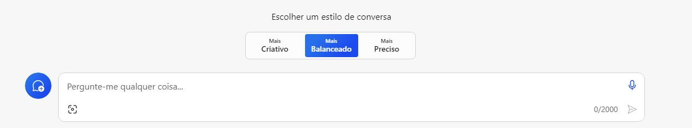
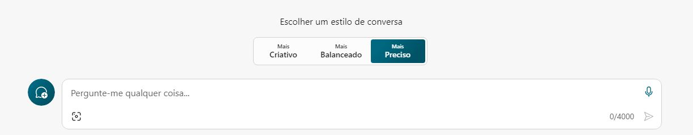
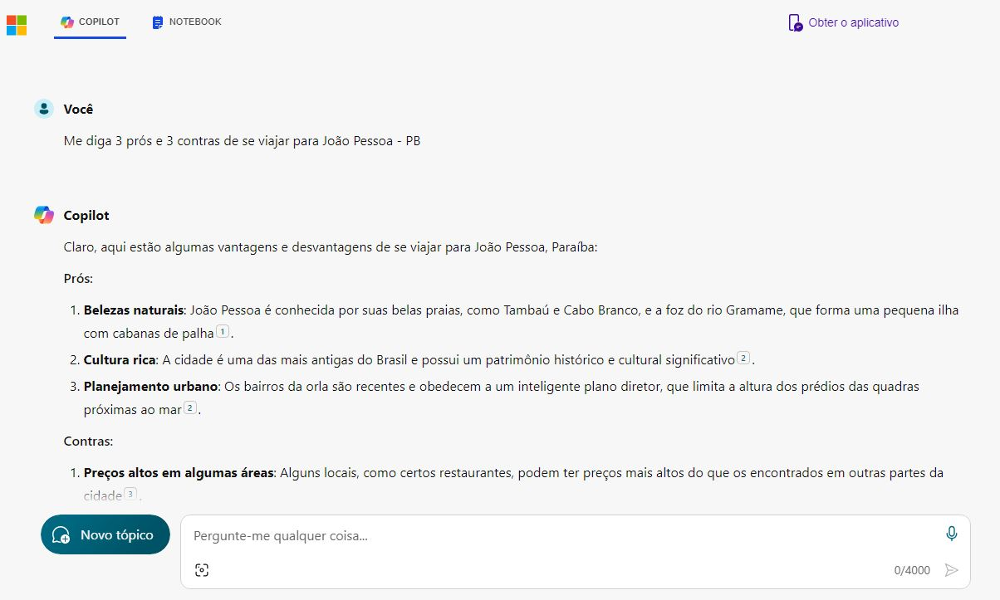
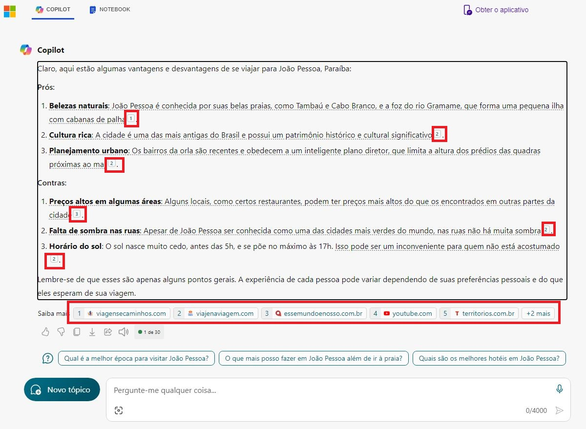
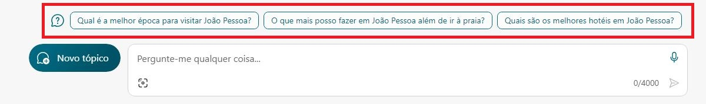
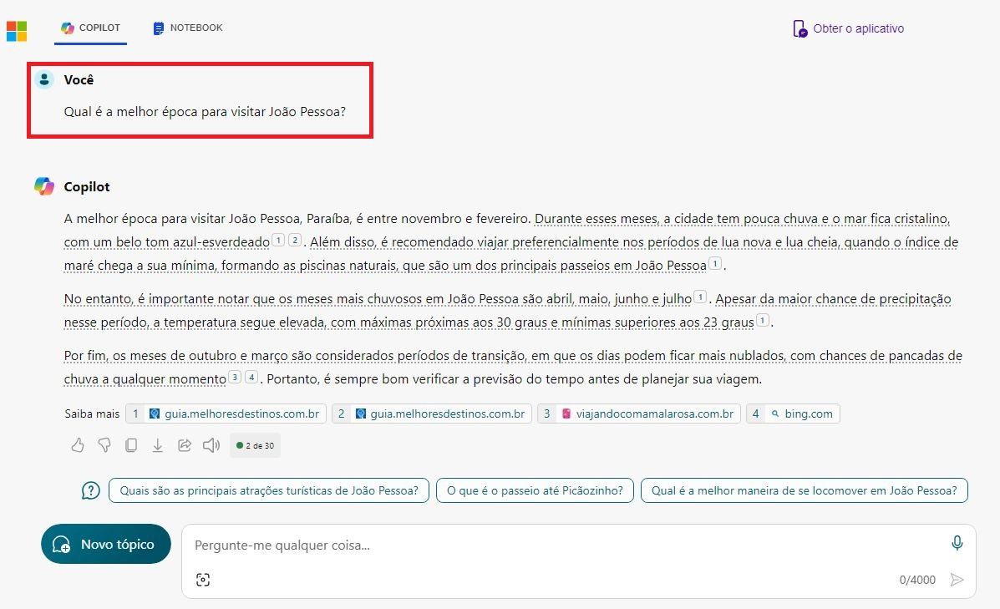
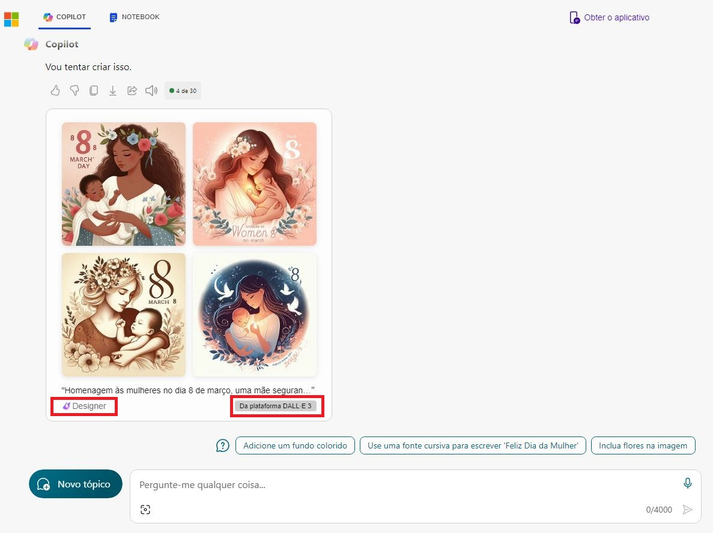
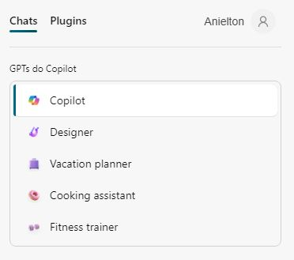
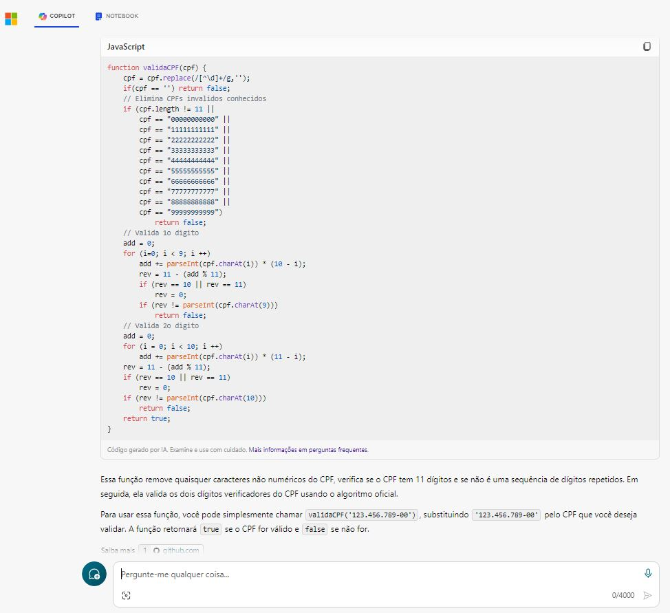

# Explorando os Recursos de IA Generativa com Copilot e OpenAI

Este desafio é o de número 5 do bootcamp e consiste na execução prática de 3 exercícios, relacionados aos seguintes temas:

- [LAB 1: AI Com Microsoft Copilot](http://aka.ms/ai900-bing-copilot): explorar IA Generativa através do Microsoft Copilot
- [LAB 2: Azure OpenAI](http://aka.ms/ai900-azure-openai): explorar o serviço OpenAI do Azure e o utilizar para implantar e experimentar modelos de IA generativa
- [LAB 3: Filtros de Conteúdo Com Azure OpenAI](http://aka.ms/ai900-content-filters): explorar o efeito dos filtros de conteúdo padrão no Azure OpenAI

> [!NOTE]
> Este projeto foi desenvolvido utilizando-se uma subscrição pessoal do Azure.
> 
> Até a data de conclusão deste projeto, a Microsoft limitava o uso do Azure Open IA para empresas.
> 
> Solicitei o acesso através do [Formulário 'Request Access to Azure OpenAI Service'](https://aka.ms/oaiapply), porém o mesmo foi recusado justamente pelo fato da minha Microsoft Azure Subscription estar associada a uma conta pessoal, e não corporativa.
> 
> Por esse motivo, infelizmente, não foi possível realizar os LABs 2 e 3.


## Passo 1
### Conhecendo a interface inicial do Microsoft Copilot

- O Copilot pode ser acessado através do link [copilot.microsoft.com](https://copilot.microsoft.com/?azure-portal=true), utilizando sua conta Microsoft pessoal

- O Microsoft Copilot usa IA generativa para aprimorar os resultados de pesquisa do Bing. Isso significa que, ao contrário da pesquisa isolada, que retorna conteúdo existente, o Microsoft Copilot pode reunir novas respostas com base na modelagem de linguagem natural e nas informações da Web
   
- Na parte inferior da tela, há uma janela do tipo ***Pergunte-me qualquer coisa***. À medida em que inseri *prompts* nesta janela, o Copilot usou todo o histórico de conversas para retornar as respostas.


- O Copilot permite trabalhar com 3 tipos de ***estilos de conversas***. Cada estilo retorna um esquema de cor, uma saudação e dicas iniciais de *prompts* diferentes. Os estilos são:

**Mais Criativo** (recomendado para respostas imaginativas e inovadoras, embora possam falhar em precisão):


**Mais Balanceado** (recomendado para saídas altamente detalhadas e precisas, mas potencialmente menos criativas):


**Mais Preciso** (recomendado para um equilíbrio entre criatividade e precisão):


## Passo 2
### Utilizando *prompts* para geração de respostas

- Para esta pesquisa, utilizei o estilo de conversação **Preciso**, buscando um equilíbrio entre criatividade e precisão. Pesquisei primeiramente o seguinte:

```
Me diga 3 prós e 3 contras de se viajar para João Pessoa - PB
```

Esta foi a resposta gerada:



- A reposta retornou marcadores que possuem links paras as fontes de dados que foram utilizadas na pesquisa:



- Além disso, o Copilot sugeriu novos *prompts*:



- Ao clicar em uma destas sugestões, ele continuou a conversa, aproveitando as *threads* anteriores, e somente parou a geração de informação quando finalizou a pesquisa (ele interromperia também se eu pressionasse **Parar de Responder**:



## Passo 3
### Utilizando *prompts* para geração de imagens

Outra função bastante interessante no uso do Copilot é a geração de imagens a partir de *prompts*.

Este recurso pode ser utilizado tanto para fins recreativos como para demandas do dia-a-dia, inclusive profissionais.

Para isso basta digitar no *prompt* e aguardar, eu pedi que fosse gerado o seguinte:

```
Crie uma imagem que homenageie as mulheres no dia 08 de março, uma mãe segurando o seu bebe.
```

- Eis as imagens geradas:



- Note que, no rodapé da imagem, apareceu a *tag* "*Powered by* DALL-E". Isto ocorre devido ao fato do Copilot utilizar o DALL-E para a geração de imagens.

O ***DALL-E*** é uma rede neural treinada pela OpenAI, com base em modelos de linguagem grandes (LLM), que cria imagens a partir de legendas de texto para uma ampla gama de conceitos expressáveis em linguagem natural.

- Outra informação que retornou no rodapé foi a palavra **Designer**. Ela indica qual GPT o Copilot utilizou para gerar a imagem

***GPT*** (*Generative Pre-Trained Transformer* ou Transformador Pré-treinado Generativo): São modelos de predição de linguagem baseados em redes neurais construídos na arquitetura *Transformer*. Eles analisam consultas em linguagem natural, conhecidas como solicitações, e preveem a melhor resposta possível com base em sua compreensão da linguagem.

- Até a data em que este projeto foi concluído, o Copilot contava com 5 GPTs diferentes, com propostas diferentes, conforme print a seguir:



- Além disso, é possível utilizar *plugins*, desenvolvidos por terceiros, para melhorar/especializar o contexto dos *prompts*, limitados a 3 por conversa. O usuário deve ter consciência de que o teor das conversas serão sempre compartilhadas com os *plugins* utilizados. Segue um print de exemplo de alguns destes *plugins* disponíveis:


## Passo 4
### Utilizando *prompts* para geração de códigos

- Por último neste laboratório ficou a parte mais interessante que é a geração de códigos a partir do *prompt*.

- Esta opção pode ser muito útil durante a codificação, pois suporta o desenvolvedor na construção e ajustes de códigos das mais variadas linguagens de programação.

- Segue um exemplo de utilização desta função:

```
Escreva um código em javascript que permita a inserção do número de cpf formatado no padrão xxx.xxx.xxx-xx e que valide se o mesmo é um cpf válido.
```

- Além de retornar a sintaxe, o Copilot trouxe uma breve descrição de como aplicar o código gerado:



- Segue o código retornado:

``` javascript
function validaCPF(cpf) {
    cpf = cpf.replace(/[^\d]+/g,'');
    if(cpf == '') return false;
    // Elimina CPFs invalidos conhecidos    
    if (cpf.length != 11 || 
        cpf == "00000000000" || 
        cpf == "11111111111" || 
        cpf == "22222222222" || 
        cpf == "33333333333" || 
        cpf == "44444444444" || 
        cpf == "55555555555" || 
        cpf == "66666666666" || 
        cpf == "77777777777" || 
        cpf == "88888888888" || 
        cpf == "99999999999")
            return false;       
    // Valida 1o digito 
    add = 0;
    for (i=0; i < 9; i ++)
        add += parseInt(cpf.charAt(i)) * (10 - i);
        rev = 11 - (add % 11);
        if (rev == 10 || rev == 11)
            rev = 0;
        if (rev != parseInt(cpf.charAt(9)))
            return false;
    // Valida 2o digito 
    add = 0;
    for (i = 0; i < 10; i ++)
        add += parseInt(cpf.charAt(i)) * (11 - i);
    rev = 11 - (add % 11);
    if (rev == 10 || rev == 11)
        rev = 0;
    if (rev != parseInt(cpf.charAt(10)))
        return false;
    return true;
}
```

## Conclusão

O Microsoft Copilot é uma ferramenta revolucionária, que transforma a maneira como interagimos com a tecnologia.

Suas capacidades de geração de texto, imagens e códigos a partir de linguagem natural abrem novos horizontes para a programação e a comunicação. Através de sua inteligência artificial avançada, o Copilot não apenas facilita a vida dos programadores, mas também torna a tecnologia mais acessível para todos.

No entanto, como qualquer tecnologia emergente, é importante lembrar que o Copilot é uma ferramenta para auxiliar, e não substituir o julgamento humano.

À medida que continuarmos a explorar suas possibilidades, devemos também considerar as implicações éticas e de privacidade.